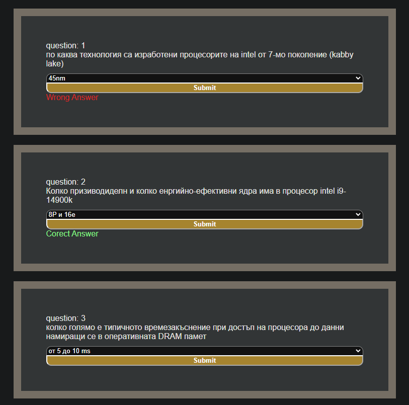

## Set-Up

Need to create new file called .env that contains :
```bash 
GEMINI_API_KEY="Ur_gemini_api_key"
```

Installing Gemini api dependencies using:
```bash 
$ go get github.com/google/generative-ai-go
```
To install [Templ](https://github.com/a-h/templ)
```bash 
$ go install github.com/a-h/templ/cmd/templ@latest
```

* For running the app is recommended to use **``'air'``** but if u not gonna do any changes its not necessary to have air, its just more easy and convenient to use it than, manualy closeing, rebuilding the project and starting it again etc.


#### Using ``air`` [repo link](https://github.com/air-verse/air)

To install **``'air'``** just run this in the console or look up the repo for installation instructions
```bash 
$ go install github.com/air-verse/air@latest 
```
After that just using **``'air'``** it will run your code, while automatically running the code when saved and automatically building the .temp files
```bash 
$ air
```
#### Without ``air`` altenativ  #TODO

* need to build templ each time.
* run main.go and whit all other files
*
*

## Adding questions 

questions can be added fairly easily added in the program, but right now does not exist a way to create questions from the app, but can be directly added from the [asset](https://github.com/aleks20905/testsWeb_templ/tree/main/assets) file.

Depending on the questions that u wanna add can be put in two categories (questions/Open questions) if u wanna add simple question with with pre define answer use the [question.json](https://github.com/aleks20905/testsWeb_templ/blob/main/assets/questions.json) and if u wanna create new Open questions use the [open_questions.json](https://github.com/aleks20905/testsWeb_templ/blob/main/assets/open_questions.json)

The structure of the data looks like :
```Go 
type Question struct {
	ID       int      // ID is generated dinamily when the file is called
	Question string   `json:"question"`
	Options  []string `json:"options"`
	Answer   []string `json:"answer"`
}
type OpenQuestion struct {
	ID       int    // ID is generated dinamily when the file is called
	Question string `json:"question"`
	Answer   string `json:"answer"`
}
```